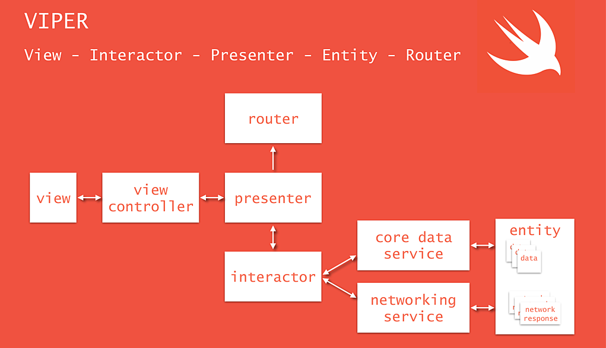

# Music App

This is a music application developed using the Swift programming language. The application allows users to play music, discover songs, and utilize various features.

## Features

- Search, play, and pause songs
- Create and manage playlists
- Add and remove songs from favorites
- Discover albums and artists
- View details such as play duration and artist information for songs

## Design Pattern: VIPER 

In this project, we preferred to use the VIPER design pattern.

- Viper is a software architectural design pattern used in software development. VIPER can be implemented in Swift or other programming languages and is specifically designed to manage the complexity of large-scale applications.

- VIPER allows for the decomposition of software and the creation of a modular structure. Each component (View, Interactor, Presenter, Entity, and Router) has a specific responsibility and communicates with each other to manage the business logic of the application.

Here is a brief description of the VIPER components:

**View**: Represents the user interface component. It receives user inputs and forwards them to the Presenter for processing, enabling the handling of user actions.
**Interactor**: Represents the component where the business logic is implemented. It retrieves data from data sources (server, database, etc.), processes the data, and provides it to the Presenter for presentation.
**Presenter**: Facilitates the communication between the View and Interactor. It receives user actions from the View, executes the necessary business logic, and updates the View with the results.
**Entity**: Represents the data models. It defines the structure and behavior of the data received from or sent to the data sources.
**Router**: Manages module transitions and navigation. It enables navigation between different screens within the application.
- VIPER promotes modularity, testability, and easier maintenance of the software. With each component having distinct responsibilities, making changes becomes localized and doesn't affect other components.

- VIPER is particularly useful in the development of large and complex applications, as it helps maintain a well-structured and manageable codebase. However, it may introduce unnecessary complexity in smaller-scale applications, so it is not necessary to use VIPER in every project.

## Requirements

- Swift 5.0 or higher
- Xcode 13.0 or higher

## Screenshot

Iphone 14 Pro            | Iphone 14 Pro           
:-------------------------:|:-------------------------:
  |   

## Used Technologies

- Swift: A programming language used for iOS app development.
- iTunes API: 
- Alamofire: A Swift library used for making HTTP requests.
- AVFoundation: A Swift framework used for playing audio pronunciations.
- Core Data: A framework used for local data storage.

## Communication
- If you have any questions, suggestions, or feedback, you can reach us at the following email address: [furkannyildirimm@hotmail.com]

